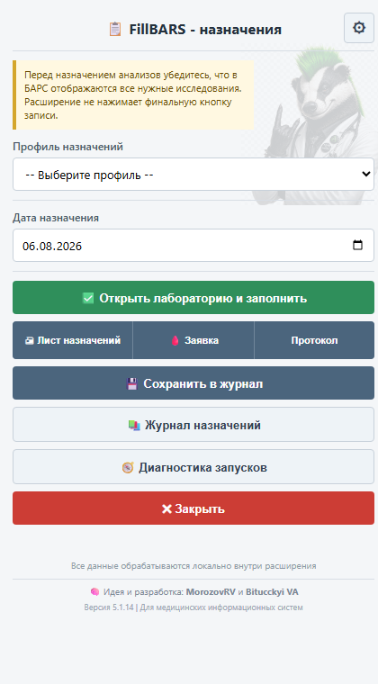
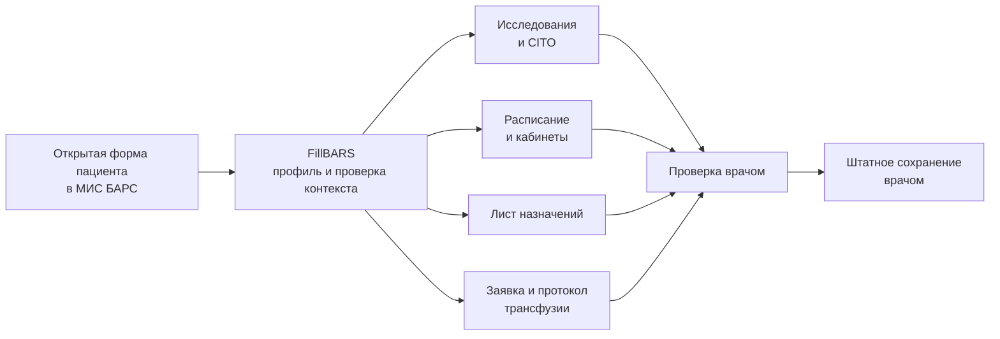

<p align="center">
  
</p>

<h1 align="center">FillBARS</h1>

<p align="center">
  <strong>Врач лечит. FillBARS заполняет.</strong><br>
  Локальное расширение для быстрого назначения исследований и подготовки медицинских документов в МИС БАРС.
</p>

<p align="center">
  <code>Версия 5.1.14</code> · <code>Yandex Browser / Chromium</code> · <code>Manifest V3</code> · <code>Локальная обработка</code> · <code>MIT</code>
</p>

<p align="center">
  <a href="#fillbars-в-работе">Интерфейс</a> ·
  <a href="#возможности">Возможности</a> ·
  <a href="#быстрый-старт">Установка</a> ·
  <a href="#как-это-работает">Как работает</a> ·
  <a href="#безопасность-и-ответственность">Безопасность</a> ·
  <a href="#проверки-для-разработчика">Проверки</a>
</p>

> [!WARNING]
> **FillBARS не является медицинским изделием, не принимает клинических решений и не заменяет контроль врача.** Расширение подготавливает форму, но не нажимает финальную кнопку записи в БАРС. Перед сохранением врач обязан проверить пациента, исследования, CITO, кабинеты и печатные документы.

## Зачем нужен FillBARS

Повторяющиеся назначения отнимают время и требуют множества одинаковых действий. FillBARS позволяет один раз собрать профиль — анализы, препараты, процедуры и режим — а затем использовать его для конкретного пациента.

Расширение работает внутри текущей авторизованной вкладки БАРС, использует штатные элементы интерфейса и оставляет окончательное подтверждение врачу.

## FillBARS в работе

<table>
  <tr>
    <td width="44%" align="center">
      <a href="docs/assets/readme/popup-5.1.14.png">
        
      </a>
    </td>
    <td width="56%">
      <h3>Один компактный рабочий экран</h3>
      <ul>
        <li>выбор профиля и даты назначения;</li>
        <li>заполнение лабораторных исследований;</li>
        <li>лист назначений, заявка на кровь и протокол трансфузии в одной строке;</li>
        <li>локальный журнал и диагностика запусков;</li>
        <li>настройки CITO, кабинетов и хранения данных.</li>
      </ul>
      <p><strong>Финальная запись всегда остаётся под контролем врача.</strong></p>
    </td>
  </tr>
</table>

<p align="center"><em>Интерфейс версии 5.1.14. Демонстрационный снимок не содержит данных пациента.</em></p>

## Возможности

| Направление | Что делает FillBARS |
| --- | --- |
| **Профили назначений** | Хранит наборы анализов, лекарственных назначений, процедур, питания и режима. Поддерживает старый формат профилей. |
| **Лаборатория** | Открывает штатную форму БАРС, показывает все исследования, выбирает нужные строки и проверяет результат. |
| **CITO и кабинеты** | Подтверждает срочность в строках исследований и подставляет точный кабинет через штатные контролы расписания. |
| **Лист назначений** | Формирует двухстраничный бланк A4 с пациентом, анализами, препаратами и процедурами. |
| **Гемотрансфузия** | Создаёт протокол трансфузии и двухстраничную заявку на компоненты крови с данными из истории болезни. |
| **Word и Excel** | Сохраняет заполненный протокол в настоящие редактируемые `.docx` и `.xlsx` для повторной правки и печати. |
| **Журнал** | Локально хранит техническую историю назначений без ФИО и даты рождения пациента. |
| **Диагностика** | Записывает последние 12 запусков без персональных данных и позволяет выгрузить выбранный лог в JSON. |

<table>
  <tr>
    <td width="33%"></td>
    <td width="33%"></td>
    <td width="33%"></td>
  </tr>
  <tr>
    <td align="center"><strong>Контроль у врача</strong></td>
    <td align="center"><strong>Документы в одном месте</strong></td>
    <td align="center"><strong>Меньше повторной работы</strong></td>
  </tr>
</table>

## Как это работает



FillBARS распознаёт целевые формы по точным контрактам исходников БАРС, ожидает фактическую готовность строк и после каждого важного действия перечитывает результат. Если форма, исследование, CITO или кабинет не подтверждены, сценарий останавливается с диагностической причиной.

## Быстрый старт

### 1. Получить проект

```powershell
git clone https://github.com/MorozovRoman-hub/FillBARS.git
cd FillBARS
```

Также можно скачать ZIP репозитория и распаковать его в постоянную папку.

### 2. Установить расширение

1. Откройте `browser://extensions` в Яндекс Браузере или Chromium.
2. Включите **Режим разработчика**.
3. Нажмите **Загрузить распакованное расширение**.
4. Выберите папку `FillBARS`, в которой находится `manifest.json`.
5. Закрепите FillBARS на панели браузера.

### 3. Выполнить назначение

1. Откройте пациента и нужную форму БАРС.
2. Откройте FillBARS и выберите профиль.
3. Проверьте дату, этап выполнения, CITO и кабинет.
4. Нажмите **Открыть лабораторию и заполнить**.
5. Проверьте результат в БАРС и только после этого сохраните его штатной кнопкой.

> [!TIP]
> Для первого запуска используйте тестового пациента и небольшой профиль. После обновления расширения всегда нажимайте **Перезагрузить** на странице расширений браузера.

## Профили назначений

Профиль объединяет три типа данных:

- `analyses` — лабораторные исследования, которые FillBARS выбирает в форме БАРС;
- `medications` — препараты для печатного листа и локального журнала;
- `procedures` — диагностические, режимные и другие назначения.

```json
{
  "analyses": {
    "97829568": true,
    "97830108": true
  },
  "medications": [],
  "procedures": []
}
```

Старые профили, содержащие только ID анализов, читаются автоматически. Справочник ЖНВЛП помогает выбрать название, АТХ, группу и лекарственную форму, но дозу, путь введения, кратность и длительность всегда указывает врач.

## Лист назначений и гемотрансфузия

Три печатных действия находятся в одном сегментированном ряду popup:

- **Лист назначений** — A4 landscape, две страницы;
- **Заявка** — лицевая и оборотная стороны заявки на компоненты крови;
- **Протокол** — одностраничный A4 portrait с выгрузкой в DOCX и XLSX.

Из активной истории болезни автоматически читаются ФИО, дата рождения и номер истории. Из служебного префикса номера выделяется отделение, сам префикс удаляется из отображаемого номера. Из профиля БАРС берутся медицинская организация и текущий врач; полное имя врача сокращается до формы `Фамилия И.О.`.

AB0/Rh реципиента синхронизируется с донорской средой. Все автоматически заполненные значения остаются редактируемыми и должны быть проверены перед печатью.

<details>
<summary><strong>Что именно входит в печатные формы</strong></summary>

### Лист назначений

- пациент, дата рождения и номер истории болезни;
- препараты и лечебное питание;
- анализы, диагностические и режимные процедуры;
- отдельная оборотная таблица медицинских вмешательств.

### Протокол трансфузии

- медицинская организация, отделение, пациент и врач;
- группа крови и Rh реципиента и донора;
- показание, компонент, номер единицы, объём и даты;
- пробы на совместимость, реакции, наблюдение и заключение;
- редактируемая выгрузка в Word и Excel.

### Заявка на компоненты крови

- отделение, пациент, возраст, история болезни и врач;
- диагноз и лабораторные показатели;
- требуемая среда, количество и группа крови;
- оборотная таблица фактически отпущенных компонентов.

</details>

## Безопасность и ответственность

> [!IMPORTANT]
> FillBARS — независимое вспомогательное расширение, а не официальный модуль МИС БАРС. Его использование требует локальной технической и клинической приёмки в конкретной организации.

- Нет внешнего сервера и внешней аналитики.
- Нет CDN-зависимостей: весь runtime находится в папке расширения.
- Данные пациента обрабатываются локально в браузере.
- ФИО и дата рождения не записываются в журнал и диагностические логи.
- Временный payload печатной формы удаляется из `localStorage` после открытия документа.
- FillBARS не нажимает финальную кнопку **Записать**.
- Диагностический JSON содержит технические ID и название профиля, поэтому его всё равно нужно просмотреть перед передачей разработчику.

Постоянно локально хранятся профили, справочники, настройки и пользовательские препараты. Журнал назначений находится в IndexedDB и автоматически очищается по выбранному сроку хранения, не более 60 дней.

## Интеграция с исходниками БАРС

<details>
<summary><strong>Source-driven контракты и защитные проверки</strong></summary>

- Форма лаборатории определяется по `GridGroups`, `GridResearch` и `GridDirline`.
- Поддерживаются реальный D3 runtime `page.d3Form` и legacy DForm `page.form`.
- `ALL_RES` активируется штатным API БАРС; готовность подтверждается только после появления нового поколения строк `GridResearch`.
- Выбранные исследования и CITO перечитываются из `GridDirline`.
- Расписание обрабатывается по стабильному ключу `RN` строки `GridServices`.
- Кабинет выбирается только при единственном точном совпадении имени и подтверждённом ID.
- Если MAIN-контекст уничтожен переходом БАРС, isolated bridge продолжает только безопасный этап расписания без повторного нажатия **Назначить**.
- Данные пациента читаются из точной формы `ArmPatientsInDep/hosp_history_new`: `PAT_FIO`, `PAT_BDATE`, `HH_PREF_NUMB`.
- ЛПУ и пользователь читаются из профиля БАРС новой или старой темы с source-backed fallback.

Исходники БАРС используются как справочный контракт и не изменяются проектом FillBARS.

</details>

## Диагностика запусков

Каждый запуск автоматизации создаёт локальный технический лог. Хранятся последние 12 запусков: этапы открытия формы, frame, состояния `ALL_RES` и Range, сигнатуры строк, технические ID, результат и причина остановки.

Лог продолжает собираться после закрытия popup, потому что события передаются в service worker и сохраняются в `chrome.storage.local`. Его можно открыть, скопировать, скачать отдельным JSON-файлом или удалить.

## Проверки для разработчика

Для проверки runtime-контрактов нужен Node.js и установленный Chromium/Chrome:

```powershell
node tests/runtime-injection-check.js
node tests/run-local-fixtures.js
git diff --check
```

Контрольная точка 5.1.14:

| Стенд | Результат |
| --- | ---: |
| DForm runtime | 43 проверки |
| Исследования и CITO | 402 проверки |
| Расписание | 72 проверки, кабинеты 4/4 |
| Протокол трансфузии | 25 проверок |
| Заявка на компоненты крови | 16 проверок |
| Статический контракт | PASS |

Тестовые стенды работают на синтетической разметке и не должны использовать данные реальных пациентов.

## Структура проекта

```text
FillBARS/
├── manifest.json                 # Manifest V3
├── popup.html / popup.js         # интерфейс и настройки
├── bars-adapter.js               # source-driven адаптер БАРС
├── fill-runner.js                # сценарий выбора и проверки
├── background.js                 # service worker и диагностика
├── print.*                       # лист назначений
├── blood-request.*               # заявка на компоненты крови
├── transfusion.*                 # протокол трансфузии
├── office-export.js              # сборка DOCX/XLSX в браузере
├── fillbars-config.json          # профили по умолчанию
├── drug-catalog-zhvnlp-2025.json # справочник препаратов
├── docs/assets/readme/           # изображения README
└── tests/                        # локальные браузерные стенды
```

## Документы и статус

- [Рабочая контрольная точка 5.1](IMPROVEMENT_PROGRESS_5.1.md) — история решений, проверок и следующий план.
- [Лицензия](LICENSE) — MIT.
- [Последний объединённый PR](https://github.com/MorozovRoman-hub/FillBARS/pull/5) — формы гемотрансфузии и Office-экспорт в 5.1.14.

<details>
<summary><strong>Ещё немного БАРСука</strong></summary>

<table>
  <tr>
    <td width="33%"></td>
    <td width="33%"></td>
    <td width="33%"></td>
  </tr>
</table>

</details>

## Авторы и лицензия

Идея и разработка: **MorozovRV** и **Bitucckyi VA**.

Код распространяется по лицензии [MIT](LICENSE) и предоставляется «как есть». Использование допускается только после самостоятельной оценки рисков и под ответственность пользователя или организации.
