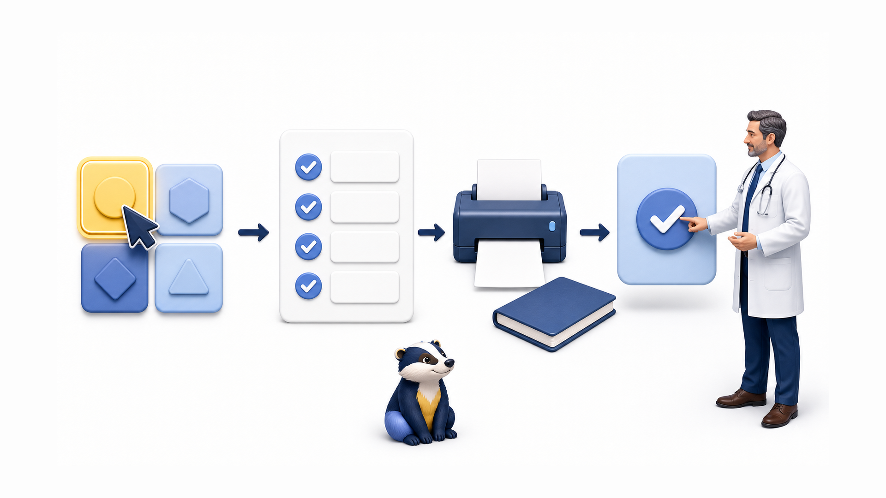
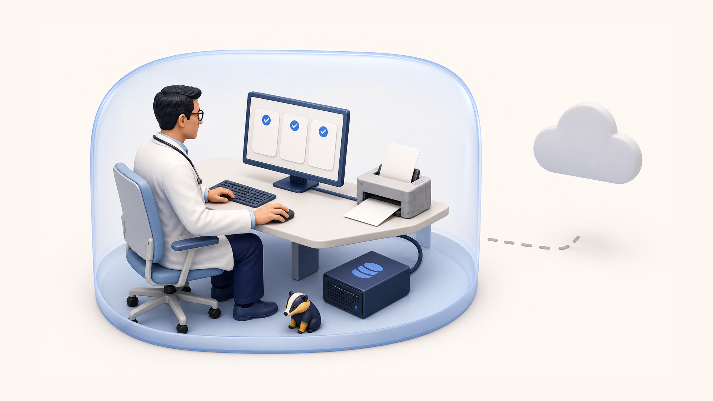

<p align="center">
  
</p>

<h1 align="center">FillBARS</h1>

<p align="center">
  <strong>Меньше повторяющихся кликов при назначении анализов в МИС БАРС.<br>Профили, печатный лист и локальный журнал — под контролем врача.</strong>
</p>

<p align="center">
  <a href="https://chromewebstore.google.com/detail/auto-form-filler-мис-барс/lanifinlkkgcndcajmhfgjpgfklaacja?hl=ru"></a>
  
  
  <a href="./LICENSE"></a>
</p>

<p align="center">
  <a href="#быстрый-старт">Быстрый старт</a> ·
  <a href="#что-умеет-fillbars">Возможности</a> ·
  <a href="#как-это-работает">Как это работает</a> ·
  <a href="#локальные-данные-и-приватность">Приватность</a> ·
  <a href="#разработка-и-проверки">Разработка</a>
</p>

> [!IMPORTANT]
> FillBARS подготавливает назначения, но **не нажимает финальную кнопку «Записать»** в МИС БАРС. Врач проверяет результат и подтверждает его самостоятельно.

## Зачем нужен FillBARS

В типовом назначении врачу приходится снова выбирать одни и те же исследования, переносить назначения в печатный лист и при необходимости вести локальную историю. FillBARS собирает эти действия в один понятный сценарий:

- выбирает набор анализов по заранее подготовленному профилю;
- может отметить выбранные исследования как CITO;
- при включённом режиме кабинетов открывает штатное расписание БАРС и подставляет кабинет;
- формирует двухстраничный лист назначений для печати на A4;
- сохраняет назначения в локальный журнал без ФИО и даты рождения пациента;
- оставляет окончательную проверку и запись врачу.

В комплекте уже есть **20 профилей** и каталог из **52 лабораторных исследований**. Профили можно менять, создавать заново и переносить между компьютерами через JSON.

<p align="center">
  
</p>

## Что умеет FillBARS

### В форме МИС БАРС

- открывает лабораторную форму и отмечает исследования из выбранного профиля;
- поддерживает обычный сценарий и режим **CITO («Срочно»)**;
- по настройке переходит к штатному расписанию и выбирает кабинет;
- проверяет, что нужные строки действительно появились и были выбраны;
- останавливает сценарий при неполном подтверждении вместо незаметного продолжения;
- не выполняет финальную запись назначения.

### В профилях

Один профиль может содержать:

- лабораторные исследования;
- лекарственные назначения;
- диагностические, режимные и другие процедуры.

Анализы передаются в форму БАРС. Препараты и процедуры используются в печатном листе и локальном журнале — расширение не пытается назначать их через лабораторную форму.

Для препаратов доступен встроенный справочник ЖНВЛП и ручное добавление. Дозу, путь введения, кратность, длительность и комментарий врач задаёт самостоятельно.

### Вне формы БАРС

- печатает двухстраничный HTML-лист назначений в формате A4 landscape;
- ведёт локальный журнал с автоочисткой;
- хранит последние 12 технических запусков для диагностики;
- импортирует и экспортирует профили, настройки и справочники одним JSON-файлом.

## Быстрый старт

### Установка из Chrome Web Store

1. Откройте [страницу FillBARS в Chrome Web Store](https://chromewebstore.google.com/detail/auto-form-filler-мис-барс/lanifinlkkgcndcajmhfgjpgfklaacja?hl=ru).
2. Нажмите **«Установить»** и подтвердите добавление расширения.
3. При необходимости закрепите FillBARS на панели браузера.
4. Откройте страницу пациента и форму назначений в МИС БАРС.

### Первое назначение

1. Откройте popup FillBARS.
2. Выберите профиль назначений.
3. Убедитесь, что в БАРС доступны все нужные исследования.
4. Нажмите **«Открыть лабораторию и заполнить»**.
5. Проверьте выбранные анализы и сообщения расширения.
6. Подтвердите назначение в БАРС самостоятельно.

> [!TIP]
> Начните с режима **«Только анализы»**. CITO и автоматический выбор кабинетов лучше включать после проверки названий и сценария на вашей сборке МИС БАРС.

<details>
<summary><strong>Ручная установка для разработки</strong></summary>

1. Скачайте или склонируйте проект в отдельную папку.
2. Откройте страницу расширений:
   - Chrome: `chrome://extensions`;
   - Яндекс Браузер: `browser://extensions`.
3. Включите **«Режим разработчика»**.
4. Нажмите **«Загрузить распакованное расширение»**.
5. Выберите папку, в которой находится `manifest.json`.

После изменения исходников нажмите кнопку обновления на карточке расширения и заново откройте popup.

</details>

## Как это работает

```text
Профиль назначений
        ↓
Проверка формы и выбор анализов
        ↓
CITO и кабинеты — только если включены
        ↓
Проверка результата расширением
        ↓
Финальная проверка и запись врачом
```

FillBARS работает в активной вкладке. Расширение распознаёт лабораторную форму МИС БАРС, запускает штатные действия интерфейса и после каждого важного шага перечитывает состояние формы. Если выбранный анализ, CITO или кабинет не подтверждены, сценарий завершается с диагностической причиной.

### Режим CITO

Опция **«Отмечать CITO («Срочно»)»** применяется к выбранным исследованиям до перехода в расписание. Если состояние хотя бы одной строки не удалось подтвердить, расширение не продолжает сценарий как обычное несрочное назначение.

### Режим кабинетов

1. Откройте настройки FillBARS.
2. Укажите точное название кабинета.
3. Выберите этап **«Кабинеты»**.
4. При необходимости включите CITO.
5. Запустите заполнение профиля.

Расширение ждёт загрузки штатного справочника кабинетов и принимает только точное однозначное совпадение. Частично обработанный сценарий не считается успешным. Финальная кнопка **«Записать»** остаётся нетронутой.

## Профили назначений

Создание и редактирование профиля выполняется через кнопку настроек в popup:

1. Нажмите шестерёнку рядом с названием FillBARS.
2. Выберите **«+ Добавить назначение»** или **«Ред.»** у готового профиля.
3. На вкладке **«Анализы»** отметьте исследования.
4. На вкладке **«Препараты»** добавьте лекарства и параметры назначения.
5. На вкладке **«Процедуры»** добавьте исследования, режим или другое назначение.
6. При необходимости измените порядок элементов.
7. Сохраните профиль.

Старые профили, состоящие только из ID анализов, продолжают читаться. При следующем экспорте они сохраняются в актуальной структуре:

```json
{
  "analyses": {
    "97829568": true,
    "97830108": true
  },
  "medications": [],
  "procedures": []
}
```

## Печатный лист назначений

1. Выберите профиль и дату назначения.
2. Оставьте активной страницу пациента в МИС БАРС.
3. Нажмите **«Открыть лист назначений»**.
4. Проверьте автоматически прочитанные данные и содержание листа.
5. Нажмите **«Печать»**.

Печатная форма рассчитана на две страницы A4 landscape:

- первая страница — лекарственные назначения, лечебное питание и режим;
- вторая страница — анализы, диагностические и другие процедуры;
- поля диагноза, аллергии, палаты и истории болезни остаются доступными для заполнения;
- служебные кнопки автоматически скрываются при печати.

## Локальные данные и приватность

<p align="center">
  
</p>

FillBARS не использует внешний сервер, не подключает библиотеки через CDN и не отправляет телеметрию. Рабочие данные хранятся средствами браузера на компьютере пользователя.

| Хранится локально | Не записывается в журнал |
| --- | --- |
| профили и настройки | ФИО пациента |
| каталог анализов и пользовательский справочник препаратов | дата рождения |
| № медицинской карты и состав назначения | адрес и заголовок страницы |
| технические ID исследований в диагностике | автоматическая отправка логов |

Журнал хранится в IndexedDB до **60 дней** и очищается при запуске popup. Если номер медицинской карты не найден, запись журнала не создаётся. Журнал можно очистить вручную в настройках.

> [!WARNING]
> Локальное хранение само по себе не заменяет требования вашей медицинской организации к защите данных. Перед передачей экспортов и диагностических JSON проверьте их содержимое и используйте утверждённый канал.

### Диагностика запусков

FillBARS сохраняет локально последние 12 технических запусков: этапы открытия формы, найденный frame, технические ID исследований, результат и причину остановки. Лог продолжает собираться после закрытия popup, но автоматически наружу не отправляется.

В диагностический лог не добавляются ФИО, номер медицинской карты, дата рождения, адрес и заголовок страницы. При этом лог содержит название профиля и технические ID исследований, поэтому его всё равно следует просмотреть перед передачей.

## Импорт и экспорт

**Экспорт настроек** создаёт один JSON-файл с профилями, активными профилями, настройками сценария, параметрами журнала, каталогом анализов и пользовательским справочником препаратов.

**Импорт настроек** загружает этот JSON обратно. Перед импортом на рабочем компьютере сохраните актуальный экспорт — это позволит быстро вернуться к предыдущим настройкам.

## Совместимость и ограничения

- расширение использует Chrome Manifest V3 и рассчитано на Chromium-браузеры;
- основная целевая среда — Google Chrome; ручная установка предусмотрена и для Яндекс Браузера;
- интеграция зависит от структуры форм МИС БАРС, поэтому после обновления БАРС сначала проверьте сценарий на тестовой записи;
- препараты и процедуры не передаются через лабораторную форму БАРС;
- расширение не ставит диагноз, не выбирает назначения за врача и не выполняет финальную запись;
- FillBARS — сторонний проект и не является официальным продуктом БАРС Груп.

## Разрешения браузера

| Разрешение | Для чего используется |
| --- | --- |
| `activeTab` | работа с открытой пользователем страницей МИС БАРС |
| `scripting` | запуск логики заполнения в активной вкладке |
| `storage` | локальное хранение профилей, настроек и диагностики |

В `manifest.json` нет постоянного разрешения на все сайты (`<all_urls>`).

## Разработка и проверки

Для локальной проверки нужен Node.js. В проекте нет обязательного этапа сборки: исходники расширения загружаются браузером напрямую.

Проверка синтаксиса JavaScript:

```powershell
node --check popup.js
node --check background.js
node --check bars-adapter.js
node --check fill-runner.js
node --check print.js
```

Проверка runtime-инъекции и локальных фикстур:

```powershell
node tests/runtime-injection-check.js
node tests/run-local-fixtures.js
```

Для версии `5.1.11` локальный набор проверок подтверждает:

- 43 проверки DForm-runtime;
- 402 проверки выбора исследований;
- 72 проверки расписания;
- 4 из 4 сценариев кабинетов.

<details>
<summary><strong>Основные файлы проекта</strong></summary>

```text
manifest.json                 конфигурация Manifest V3
popup.html / popup.js         интерфейс, профили, журнал и запуск сценария
background.js                 service worker и диагностический bridge
bars-adapter.js               адаптация к формам МИС БАРС
fill-runner.js                выполнение и проверка этапов заполнения
print.html / print.css        двухстраничный печатный лист
print.js                      подготовка данных к печати
fillbars-config.json          профили, настройки и каталог анализов
drug-catalog-zhvnlp-2025.json встроенный справочник препаратов
tests/                        локальные runtime-фикстуры
```

</details>

## Безопасное использование

Перед каждым финальным сохранением:

1. сопоставьте выбранный профиль с текущей клинической задачей;
2. проверьте список анализов, CITO и кабинеты;
3. проверьте препараты, дозировки, процедуры и дату печатного листа;
4. только после этого подтвердите назначение штатными средствами МИС БАРС.

## Лицензия

Проект распространяется по лицензии [MIT](./LICENSE). © 2026 MorozovRV.
